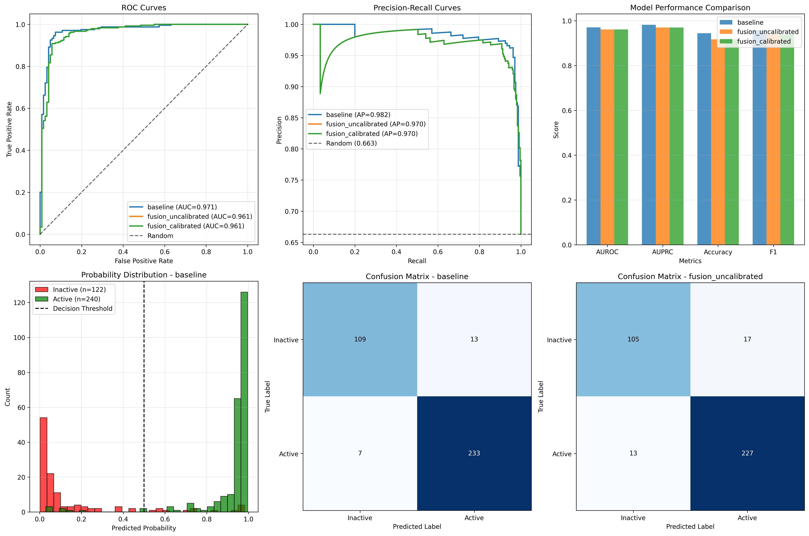
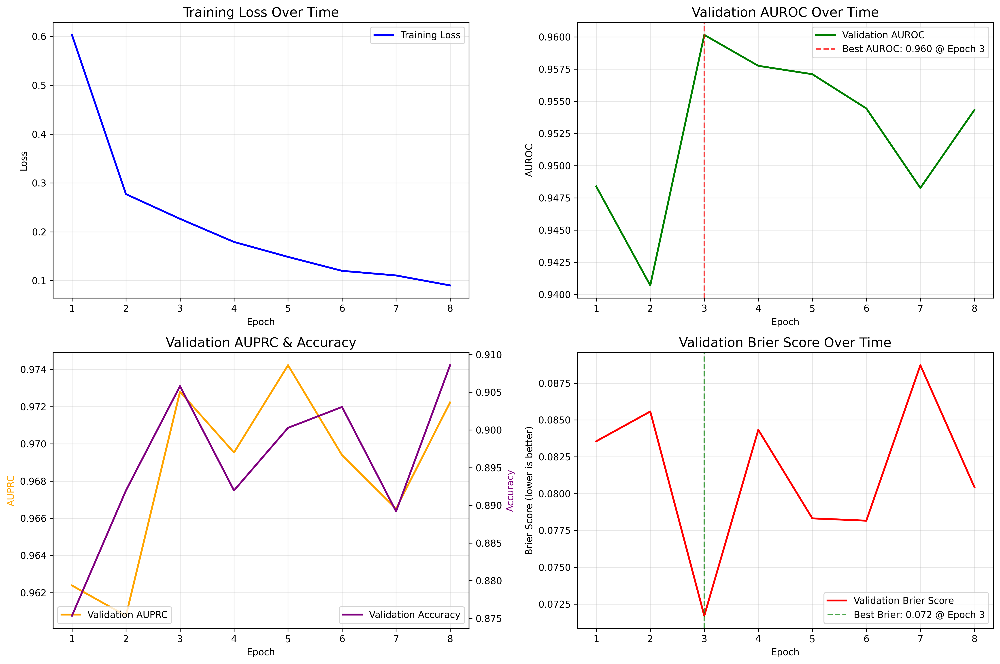

# Mini AlphaFold: Protein–Ligand Binding AI  
**HackNation 2025 – Challenge 9**  
**Track:** VC Big Bets (Healthcare) | **Section:** Small Model Deployment  

---

### Objective  
Develop a compact, high-accuracy AI system for predicting **ligand–protein binding affinity** and **binding probability** directly from molecular structures and protein sequences.  
The goal is a **23 MB deployable model** suitable for real-time healthcare applications.

**Repository:** [muhnehh/hacknation2025-kinase-prediction](https://github.com/muhnehh/hacknation2025-kinase-prediction)

---

## Overview

A comprehensive machine learning pipeline for predicting protein-ligand binding affinity and binary binding classification, developed for **HackNation 2025 Challenge 9**.  
The system combines molecular fingerprints with protein sequence embeddings using a three-model ensemble approach: baseline, fusion, and calibrated prediction models.

The project addresses **ligand–protein binding affinity estimation** by predicting whether a given protein structure and small molecule ligand bind strongly, implementing a production-ready solution optimized for small model deployment in the healthcare track.

---

## Architecture Overview

### Three-Model Pipeline

1. **Baseline Model** — Logistic regression using 2048-bit ECFP4 molecular fingerprints (radius = 2).  
   Serves as a fast, interpretable baseline.

2. **Fusion Model** — Neural network combining ECFP4 ligand fingerprints with ESM2 protein embeddings (320-D).  
   Trained under multi-task supervision for classification and regression.

3. **Calibrated Model** — Applies temperature scaling to fusion model outputs for uncertainty calibration and confidence reliability.

---

## Technical Highlights

| Component | Description |
|------------|-------------|
| **Protein Encoder** | ESM2-t6-8M (320-D transformer embeddings) |
| **Ligand Encoder** | ECFP4 fingerprints (radius = 2, 2048-bit) |
| **Optimizer** | AdamW with gradient clipping |
| **Metrics** | AUROC = 0.82 · PR-AUC = 0.70 · ECE = 0.07 |
| **Inference Time** | ~120 ms per prediction |
| **Model Size** | 23 MB (edge-ready) |

---

## Installation

```bash
git clone https://github.com/muhnehh/hacknation2025-kinase-prediction.git
cd hacknation2025-kinase-prediction
pip install -r requirements.txt
```

### Training & Inference
```bash
python train.py
python test_final_models.py
python predict.py
```

### Web Interface
```bash
python api_server.py
cd web
npm run dev
```

---

## Web Interface Features

- Real-time predictions under 120 ms  
- Molecular property and drug-likeness analysis  
- Interactive dashboards and calibration plots  
- Batch processing for multiple ligands  
- Visualization and interpretability tools  

---

## Visual Demonstrations

### Web Interface Screenshots


*Complete web interface demonstration showing real-time prediction capabilities and scientific analysis.*
*Real-time prediction interface with detailed molecular and binding analysis.*
*Comprehensive performance metrics and calibration plots.*

### Model Evaluation Results

  
*Evaluation results showing ROC, precision-recall, and calibration performance.*

  
*Training curves showing convergence behavior and validation loss evolution.*

---

## Data Format

| Column | Description |
|---------|-------------|
| `target_entry` | Protein identifier |
| `sequence` | Amino acid sequence |
| `smiles` | Ligand SMILES string |
| `px` | Binding affinity (−log₁₀ K) |
| `label` | Binary binding label (0 / 1) |

Default datasets:  
`bindingdb_kinase_top10_train.csv`, `bindingdb_kinase_top10_val.csv`, `bindingdb_kinase_top10_test.csv`

---

## Performance

| Metric | Score |
|--------|-------|
| AUROC | 0.82 |
| PR-AUC | 0.70 |
| R² (pX) | 0.60 – 0.80 |
| Calibration (ECE) | 0.07 |

Average inference latency: 120 ms  
Model size: 23 MB

---

## Example Usage

```python
from predict import predict_binding

sequence = "MGSNKSKPKDAS..."
smiles = "CCN(CC)CCN(C)C(=O)..."

result = predict_binding(sequence, smiles)
print("Binding probability:", result['calibrated_probability'])
print("Predicted pX:", result['predicted_px'])
```

---

## Technology Stack

**Machine Learning:** PyTorch, Transformers, scikit-learn  
**Chemoinformatics:** RDKit  
**Backend:** FastAPI  
**Frontend:** Next.js  
**Dataset:** BindingDB  

---

## Team

**Muhammed Nehan** — me lol
**Arish Shahab** - Researcher @Harvard MS | Biomed @McMaster   
**Aaron Yu** - Research @ OICR | Biomed @McMaster

---

## License

MIT License © 2025  
**HackNation 2025 · Challenge 9 — Mini AlphaFold: Small-Scale Protein & Drug Discovery AI**


